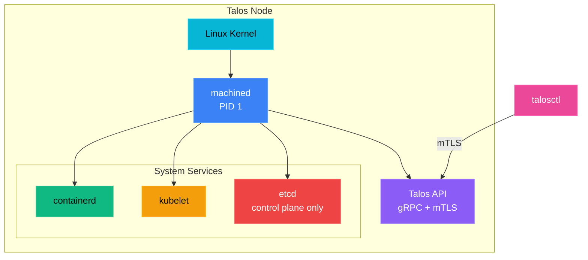

# Introduction to Talos Linux

The Kubernetes Operating System

<!-- <div class="pt-12"> -->
<!--   <span class="px-2 py-1 rounded cursor-pointer" hover="bg-white bg-opacity-10"> -->
<!--     Press Space for next page <carbon:arrow-right class="inline"/> -->
<!--   </span> -->
<!-- </div> -->

<div class="abs-br m-6 flex gap-2">
  <a href="https://talos.dev" target="_blank" class="text-xl slidev-icon-btn opacity-50 !border-none !hover:text-white">
    <carbon:link />
  </a>
  <a href="https://github.com/siderolabs/talos" target="_blank" class="text-xl slidev-icon-btn opacity-50 !border-none !hover:text-white">
    <carbon:logo-github />
  </a>
</div>

<!--
SPEAKER NOTES - Slide 1: Title

- Welcome everyone to this introduction to Talos Linux
- Today we'll explore why Talos is revolutionizing how we run Kubernetes
- By the end, you'll understand what makes Talos different and whether it's right for your use case
- Feel free to ask questions at any time or save them for the end
-->

---
transition: fade-out
layout: image-right
image: https://images.unsplash.com/photo-1451187580459-43490279c0fa?w=1200&q=90&auto=format
---

# What is Talos Linux?

<v-clicks>

- A **modern Linux distribution** built specifically for Kubernetes

- Developed by **Sidero Labs**

- **Not based on any other distribution** - built from scratch

- Runs the Linux kernel with custom userspace written in **Go**

- **No shell, no SSH, no packages** - everything is API-driven

- Designed to be **secure, immutable, and minimal**

</v-clicks>

<style>
h1 {
  background-color: #2B90B6;
  background-image: linear-gradient(45deg, #4EC5D4 10%, #146b8c 20%);
  background-size: 100%;
  -webkit-background-clip: text;
  -moz-background-clip: text;
  -webkit-text-fill-color: transparent;
  -moz-text-fill-color: transparent;
}
</style>

<!--
SPEAKER NOTES - Slide 2: What is Talos Linux?

- Talos is NOT Ubuntu, NOT Debian, NOT based on anything - it's built from scratch
- Sidero Labs (formerly Talos Systems) created it specifically for Kubernetes
- The entire userspace is written in Go - no bash, no coreutils
- Instead of systemd, it runs "machined" as PID 1
- Key point: There's literally no way to SSH in - this is a feature, not a limitation
- Think of it as an "appliance OS" - like a router firmware but for Kubernetes
-->

---
layout: two-cols
layoutClass: gap-16
---

# Why Talos Linux?

Traditional Linux distributions come with:

<v-clicks>

- SSH access (attack surface)
- Package managers (dependency hell)
- Configuration drift
- Manual maintenance
- Security vulnerabilities
- Shell access for attackers

</v-clicks>

::right::

<div class="mt-10">

## Talos Provides

<v-clicks>

- **No SSH** - API-only access
- **No packages** - single immutable image
- **No drift** - declarative configuration
- **Automatic updates** - atomic and reversible
- **Minimal attack surface**
- **No shell** for attackers to exploit

</v-clicks>

</div>

<!--
SPEAKER NOTES - Slide 3: Why Talos Linux?

- Let's talk about the problems with traditional Linux for Kubernetes
- SSH is the #1 attack vector - if an attacker gets shell access, game over
- Package managers create "dependency hell" and version conflicts
- Configuration drift: servers become "snowflakes" over time - no two are identical
- With Talos, these problems simply don't exist
- No SSH means attackers can't get a shell even if they compromise a container
- Single image = no packages to manage or update individually
- Declarative config = every node is identical and reproducible
-->

---
layout: center
class: text-center
background: https://images.unsplash.com/photo-1550751827-4bd374c3f58b?w=1920&q=90&auto=format
---

# Core Design Principles

<div class="grid grid-cols-3 gap-8 mt-10">
  <div v-click class="bg-black bg-opacity-50 p-6 rounded-lg">
    <div class="text-4xl mb-4">
      <carbon:security />
    </div>
    <h3 class="text-xl font-bold mb-2">Secure</h3>
    <p class="text-sm opacity-80">Minimal attack surface with mTLS authentication</p>
  </div>

  <div v-click class="bg-black bg-opacity-50 p-6 rounded-lg">
    <div class="text-4xl mb-4">
      <carbon:locked />
    </div>
    <h3 class="text-xl font-bold mb-2">Immutable</h3>
    <p class="text-sm opacity-80">Read-only root filesystem prevents tampering</p>
  </div>

  <div v-click class="bg-black bg-opacity-50 p-6 rounded-lg">
    <div class="text-4xl mb-4">
      <carbon:cube />
    </div>
    <h3 class="text-xl font-bold mb-2">Minimal</h3>
    <p class="text-sm opacity-80">Only essential components for Kubernetes</p>
  </div>
</div>

<!--
SPEAKER NOTES - Slide 4: Core Design Principles

- These three principles guide every decision in Talos
- SECURE: mTLS (mutual TLS) means both client AND server verify each other
- IMMUTABLE: You literally cannot modify the root filesystem - it's read-only
- MINIMAL: Only what's needed to run Kubernetes - nothing else
- Ask audience: "How many of you have had security incidents due to SSH access?"
- These principles eliminate entire categories of security vulnerabilities
-->

---
layout: default
---

# Key Features

<div class="grid grid-cols-2 gap-4 mt-4">

<div v-click class="p-3 bg-gray-800 rounded-lg">
  <h4 class="text-blue-400 font-bold mb-1"><carbon:api class="inline mr-1"/> API-Driven Management</h4>
  <p class="text-sm opacity-80">All operations through secure gRPC API</p>
</div>

<div v-click class="p-3 bg-gray-800 rounded-lg">
  <h4 class="text-green-400 font-bold mb-1"><carbon:locked class="inline mr-1"/> Immutable Infrastructure</h4>
  <p class="text-sm opacity-80">Read-only root filesystem</p>
</div>

<div v-click class="p-3 bg-gray-800 rounded-lg">
  <h4 class="text-purple-400 font-bold mb-1"><carbon:document class="inline mr-1"/> Declarative Configuration</h4>
  <p class="text-sm opacity-80">YAML-based reproducible deployments</p>
</div>

<div v-click class="p-3 bg-gray-800 rounded-lg">
  <h4 class="text-orange-400 font-bold mb-1"><carbon:upgrade class="inline mr-1"/> Automatic Updates</h4>
  <p class="text-sm opacity-80">Atomic updates with rollback</p>
</div>

<div v-click class="p-3 bg-gray-800 rounded-lg">
  <h4 class="text-cyan-400 font-bold mb-1"><carbon:cloud class="inline mr-1"/> Multi-Platform Support</h4>
  <p class="text-sm opacity-80">Bare metal, cloud, virtualization</p>
</div>

<div v-click class="p-3 bg-gray-800 rounded-lg">
  <h4 class="text-pink-400 font-bold mb-1"><carbon:kubernetes class="inline mr-1"/> Built for Kubernetes</h4>
  <p class="text-sm opacity-80">Optimized from the ground up</p>
</div>

</div>

<!--
SPEAKER NOTES - Slide 5: Key Features

- API-Driven: Everything is done via gRPC API - no SSH, no console login needed
- Immutable: Root filesystem is squashfs - literally read-only at the kernel level
- Declarative: YAML config defines entire system state - version control your infrastructure
- Automatic Updates: A/B partition scheme - if update fails, automatic rollback
- Multi-Platform: Same Talos image works everywhere - AWS, bare metal, Raspberry Pi
- Built for K8s: Not a general-purpose OS adapted for containers - purpose-built
-->

---
transition: slide-up
---

# Architecture Overview



<div v-click class="mt-4 text-center text-sm opacity-75">
No systemd, no shell, no SSH - just what's needed for Kubernetes
</div>

<!--
SPEAKER NOTES - Slide 6: Architecture Overview

- Walk through the diagram from bottom to top
- Linux Kernel: Standard Linux kernel - nothing exotic here
- machined: This replaces systemd - it's the init system written in Go
- Talos API: gRPC server with mTLS - this is how you manage everything
- containerd: Standard container runtime - same as most K8s distros
- kubelet: Standard Kubernetes kubelet
- etcd: Only on control plane nodes - stores cluster state
- talosctl: The CLI tool you use to manage Talos - think of it like SSH replacement
- Key insight: The entire stack is designed for Kubernetes - nothing extra
-->

---
layout: two-cols
---

# Security Model

<v-clicks>

### No SSH Access
- Eliminates remote shell attacks
- All access via authenticated API

### Mutual TLS (mTLS)
- All API communications encrypted
- Client certificate authentication

### Signed Kernel Modules
- Cryptographically validated
- Tamper-proof kernel

### Read-Only Root
- Prevents filesystem modifications
- Immutable system state

</v-clicks>

::right::

<div class="pl-8 mt-10">

```yaml
# Example: Role-based API access
machine:
  features:
    kubernetesTalosAPIAccess:
      enabled: true
      allowedRoles:
        - os:reader
        - os:admin
      allowedKubernetesNamespaces:
        - kube-system
```

<v-click>

<div class="mt-6 p-4 bg-green-900 bg-opacity-30 rounded-lg">
  <carbon:checkmark-filled class="text-green-400 inline mr-2" />
  <span class="text-green-300">Security by design, not by configuration</span>
</div>

</v-click>

</div>

<!--
SPEAKER NOTES - Slide 7: Security Model

- No SSH: This is the biggest mindset shift - you cannot shell into the machine
- mTLS: Both client and server present certificates - no passwords anywhere
- Signed Kernel Modules: Every kernel module is cryptographically signed
- Read-Only Root: Even if an attacker gets code execution, they can't persist changes
- The code example shows how you can grant API access to pods in your cluster
- This is useful for operators that need to manage Talos from within Kubernetes
- Key message: Security is built-in, not bolted-on
-->

---
layout: center
background: https://images.unsplash.com/photo-1526374965328-7f61d4dc18c5?w=1920&q=90&auto=format
---

# Immutability Explained

<div class="grid grid-cols-2 gap-12 mt-8">

<div v-click class="bg-black bg-opacity-60 p-6 rounded-lg">
  <h3 class="text-xl font-bold mb-4 text-red-400">Traditional Linux</h3>

  - Mutable filesystem
  - Package updates change system
  - Configuration drift over time
  - Difficult to reproduce state
  - Security patches are additive
</div>

<div v-click class="bg-black bg-opacity-60 p-6 rounded-lg">
  <h3 class="text-xl font-bold mb-4 text-green-400">Talos Linux</h3>

  - Read-only root filesystem
  - Atomic image-based updates
  - Consistent state always
  - 100% reproducible
  - Whole-image security updates
</div>

</div>

<!--
SPEAKER NOTES - Slide 8: Immutability Explained

- Traditional Linux: Think about your production servers - are any two exactly the same?
- Configuration drift happens over time: hotfixes, manual changes, forgotten scripts
- "It works on my machine" becomes "it worked last week"
- Talos approach: The OS image is like a container image - immutable and versioned
- Updates replace the entire OS image atomically - not individual packages
- If something goes wrong, rollback is instant - just boot the previous image
- Every Talos node running the same version is IDENTICAL - guaranteed
-->

---

# Managing Talos with talosctl

The `talosctl` CLI is your primary interface to Talos clusters.

<div class="grid grid-cols-2 gap-8">

<div>

```bash {all|1-2|4-5|7-8|10-11}
# Get cluster information
talosctl get members

# Apply configuration
talosctl apply-config --nodes 10.0.0.1 -f config.yaml

# View services status
talosctl services

# Access logs
talosctl logs kubelet
```

</div>

<div v-click>

```bash
# Upgrade Talos
talosctl upgrade --nodes 10.0.0.1 \
  --image ghcr.io/siderolabs/installer:v1.11.0

# Get resources (kubectl-like)
talosctl get rd  # resource definitions

# Dashboard view
talosctl dashboard
```

</div>

</div>

<v-click>

<div class="mt-6 text-center">
  <carbon:information class="inline mr-2 text-blue-400" />
  <span class="opacity-75">No need for SSH - everything is done through the API</span>
</div>

</v-click>

<!--
SPEAKER NOTES - Slide 9: Managing Talos with talosctl

- talosctl is your SSH replacement - but it's much more powerful
- "get members" shows all nodes in the cluster
- "apply-config" pushes configuration to nodes - like kubectl apply but for the OS
- "services" shows running services - similar to systemctl status
- "logs" lets you view any service logs - kubelet, containerd, etcd
- "upgrade" does rolling OS upgrades - specify the new image version
- "dashboard" gives you a nice TUI for monitoring
- Demo tip: If you have a cluster running, show talosctl dashboard live
-->

---
layout: image-right
image: https://images.unsplash.com/photo-1629654297299-c8506221ca97?w=1200&q=90&auto=format
---

# Configuration Example

```yaml
version: v1alpha1
machine:
  type: controlplane
  certSANs:
    - 10.0.0.1
    - talos.local
  kubelet:
    image: ghcr.io/siderolabs/kubelet:v1.32.0
  network:
    hostname: talos-cp-1
    interfaces:
      - interface: eth0
        dhcp: true
cluster:
  clusterName: my-cluster
  controlPlane:
    endpoint: https://10.0.0.1:6443
  network:
    cni:
      name: cilium
```

<v-click>

<div class="mt-4 text-sm">
  <carbon:arrow-right class="inline text-green-400" />
  Declarative, version-controlled, reproducible
</div>

</v-click>

<!--
SPEAKER NOTES - Slide 10: Configuration Example

- This is a minimal control plane configuration
- version: v1alpha1 is the current config version - it's stable
- machine.type: controlplane or worker - that's it
- certSANs: Additional DNS names/IPs for the API server certificate
- kubelet.image: You can pin specific Kubernetes versions
- network: Configure hostname, interfaces, DHCP or static IPs
- cluster section: Cluster-wide settings shared across all nodes
- CNI: We're using Cilium here - Talos supports Flannel, Calico, Cilium, and others
- Key point: This YAML is your entire OS configuration - version control it!
-->

---

# Platform Support

<div class="grid grid-cols-3 gap-6 mt-8">

<div v-click class="text-center p-6 bg-gray-800 rounded-lg">
  <div class="text-5xl mb-4"><carbon:bare-metal-server /></div>
  <h3 class="font-bold mb-2">Bare Metal</h3>
  <p class="text-sm opacity-75">ISO, PXE boot, USB</p>
</div>

<div v-click class="text-center p-6 bg-gray-800 rounded-lg">
  <div class="text-5xl mb-4"><carbon:cloud /></div>
  <h3 class="font-bold mb-2">Cloud Providers</h3>
  <p class="text-sm opacity-75">AWS, GCP, Azure, DigitalOcean, Hetzner</p>
</div>

<div v-click class="text-center p-6 bg-gray-800 rounded-lg">
  <div class="text-5xl mb-4"><carbon:virtual-machine /></div>
  <h3 class="font-bold mb-2">Virtualization</h3>
  <p class="text-sm opacity-75">VMware, Proxmox, QEMU, Hyper-V</p>
</div>

</div>

<v-click>

<div class="mt-8 grid grid-cols-2 gap-6">

<div class="text-center p-4 bg-gray-800 rounded-lg">
  <div class="text-3xl mb-2"><carbon:chip /></div>
  <h3 class="font-bold">SBCs</h3>
  <p class="text-sm opacity-75">Raspberry Pi, Jetson Nano</p>
</div>

<div class="text-center p-4 bg-gray-800 rounded-lg">
  <div class="text-3xl mb-2"><carbon:edge-node /></div>
  <h3 class="font-bold">Edge</h3>
  <p class="text-sm opacity-75">IoT and edge computing</p>
</div>

</div>

</v-click>

<!--
SPEAKER NOTES - Slide 11: Platform Support

- Talos runs EVERYWHERE - that's a huge advantage
- Bare Metal: Boot from ISO, USB, or PXE - great for on-prem datacenters
- Cloud: Official images for AWS, GCP, Azure, DigitalOcean, Hetzner, and more
- Virtualization: Works with VMware, Proxmox, QEMU, Hyper-V - perfect for home labs
- SBCs: Yes, it runs on Raspberry Pi 4! Great for edge computing and learning
- Edge: Lightweight footprint makes it ideal for IoT and edge deployments
- Key benefit: Same OS, same tooling, same experience everywhere
- You can move workloads between cloud and on-prem without changing anything
-->

---
layout: center
---

# Use Cases

<div class="grid grid-cols-2 gap-8 mt-6">

<div v-click class="p-6 border border-gray-600 rounded-lg">
  <h3 class="text-xl font-bold mb-3 text-blue-400">
    <carbon:enterprise class="inline mr-2" />
    Production Kubernetes
  </h3>
  <p class="text-sm opacity-80">
    Run secure, maintainable Kubernetes clusters with predictable behavior and easy upgrades.
  </p>
</div>

<div v-click class="p-6 border border-gray-600 rounded-lg">
  <h3 class="text-xl font-bold mb-3 text-green-400">
    <carbon:edge-node class="inline mr-2" />
    Edge Computing
  </h3>
  <p class="text-sm opacity-80">
    Lightweight and secure for resource-constrained edge environments.
  </p>
</div>

<div v-click class="p-6 border border-gray-600 rounded-lg">
  <h3 class="text-xl font-bold mb-3 text-purple-400">
    <carbon:home class="inline mr-2" />
    Home Labs
  </h3>
  <p class="text-sm opacity-80">
    Perfect for learning Kubernetes with a production-grade experience.
  </p>
</div>

<div v-click class="p-6 border border-gray-600 rounded-lg">
  <h3 class="text-xl font-bold mb-3 text-orange-400">
    <carbon:server-dns class="inline mr-2" />
    High-Performance Computing
  </h3>
  <p class="text-sm opacity-80">
    Minimal overhead maximizes resources for compute-intensive workloads.
  </p>
</div>

</div>

<!--
SPEAKER NOTES - Slide 12: Use Cases

- Production Kubernetes: Companies like Sidero Labs customers run mission-critical workloads
- Security and predictability are the main drivers for enterprise adoption
- Edge Computing: Talos is small (~80MB) and boots fast - perfect for edge
- Remote locations with limited bandwidth benefit from atomic updates
- Home Labs: This is where many people first try Talos
- Great learning experience - you get production-grade K8s at home
- HPC: No wasted resources on unnecessary services
- Every MB of RAM goes to your workloads, not the OS
- Ask: "Which use case resonates most with your situation?"
-->

---
layout: two-cols
---

# KubeSpan

Built-in WireGuard mesh networking for secure cluster communication.

<v-clicks>

### What is KubeSpan?
- **Encrypted mesh network** using WireGuard
- **Automatic peer discovery** via cluster discovery service
- **Zero configuration** - just enable it

### Benefits
- Secure node-to-node communication
- Works across clouds and on-premises
- NAT traversal built-in
- No external VPN required

</v-clicks>

::right::

<div class="pl-6 mt-8">

```yaml
# Enable KubeSpan
machine:
  network:
    kubespan:
      enabled: true
cluster:
  discovery:
    enabled: true
```

<v-click>

```bash
# Check KubeSpan status
talosctl get kubespanpeerspecs
talosctl get kubespanpeerstatuses
```

</v-click>

<v-click>

<div class="mt-4 p-3 bg-purple-900 bg-opacity-30 rounded-lg">
  <carbon:network-4 class="text-purple-400 inline mr-2" />
  <span class="text-sm text-purple-300">Secure multi-cloud clusters made easy</span>
</div>

</v-click>

</div>

<!--
SPEAKER NOTES - Slide 13: KubeSpan

- KubeSpan is Talos's built-in WireGuard mesh networking
- WireGuard: Modern, fast, secure VPN protocol - now built into Linux kernel
- Problem it solves: How do you connect nodes across different networks securely?
- Traditional approach: Set up VPNs, configure firewalls, manage certificates
- KubeSpan approach: Just enable it - Talos handles everything automatically
- Nodes discover each other via the cluster discovery service
- NAT traversal works out of the box - even behind firewalls
- Use case: Hybrid cloud - nodes in AWS talking to nodes in your datacenter
- Two lines of config and you have encrypted node-to-node communication
-->

---

# Getting Started

<div class="grid grid-cols-2 gap-8">

<div>

### 1. Install talosctl

```bash
# macOS
brew install siderolabs/tap/talosctl

# Linux
curl -sL https://talos.dev/install | sh
```

### 2. Generate Configuration

```bash
talosctl gen config my-cluster \
  https://10.0.0.1:6443
```

</div>

<div>

### 3. Apply Configuration

```bash
talosctl apply-config \
  --insecure \
  --nodes 10.0.0.1 \
  --file controlplane.yaml
```

### 4. Bootstrap Cluster

```bash
talosctl bootstrap \
  --nodes 10.0.0.1

# Get kubeconfig
talosctl kubeconfig
```

</div>

</div>

<v-click>

<div class="mt-6 p-4 bg-blue-900 bg-opacity-30 rounded-lg text-center">
  <carbon:rocket class="inline mr-2 text-blue-400" />
  Your secure Kubernetes cluster is ready in minutes!
</div>

</v-click>

<!--
SPEAKER NOTES - Slide 14: Getting Started

- Getting started is surprisingly easy - 4 steps to a running cluster
- Step 1: Install talosctl - brew on Mac, curl script on Linux
- Step 2: Generate config - this creates controlplane.yaml, worker.yaml, and talosconfig
- The endpoint URL is your API server address - use a load balancer in production
- Step 3: Apply config - the --insecure flag is only needed for initial bootstrap
- After first boot, all communication is secured with mTLS
- Step 4: Bootstrap - this initializes etcd and starts the Kubernetes control plane
- Then get your kubeconfig and you're ready to deploy workloads!
- Demo tip: If time permits, show a quick cluster bootstrap
-->

---

# Talos vs Traditional Linux

| Feature | Traditional Linux | Talos Linux |
|---------|------------------|-------------|
| Shell Access | Yes (bash, sh) | None |
| SSH | Enabled by default | Not available |
| Package Manager | apt, yum, etc. | None - single image |
| Init System | systemd | machined (custom) |
| Configuration | Files, scripts | Declarative YAML |
| Updates | Package-by-package | Atomic image updates |
| Root Filesystem | Read-write | Read-only |
| Attack Surface | Large | Minimal |

<v-click>

<div class="mt-4 text-center">
  <span class="text-green-400 font-bold">Result:</span>
  Drastically reduced complexity and attack vectors
</div>

</v-click>

<!--
SPEAKER NOTES - Slide 15: Talos vs Traditional Linux

- This table summarizes everything we've discussed
- Shell Access: Traditional = yes, Talos = none - biggest security win
- SSH: Traditional = default on, Talos = doesn't exist
- Package Manager: apt/yum vs single immutable image
- Init System: systemd vs machined (custom, written in Go)
- Configuration: Files scattered everywhere vs single YAML
- Updates: Package-by-package vs atomic image replacement
- Root Filesystem: Read-write vs read-only
- Attack Surface: Large vs minimal
- The result: Talos eliminates entire categories of security vulnerabilities
- Trade-off: You lose flexibility but gain security and predictability
-->

---
layout: center
class: text-center
background: https://images.unsplash.com/photo-1544197150-b99a580bb7a8?w=1920&q=90&auto=format
---

# Key Takeaways

<div class="grid grid-cols-3 gap-8 mt-10 text-left">

<div v-click class="bg-black bg-opacity-60 p-6 rounded-lg">
  <h3 class="text-green-400 font-bold mb-2">Security First</h3>
  <p class="text-sm">No SSH, mTLS everywhere, signed kernels, minimal attack surface</p>
</div>

<div v-click class="bg-black bg-opacity-60 p-6 rounded-lg">
  <h3 class="text-blue-400 font-bold mb-2">Predictable</h3>
  <p class="text-sm">Immutable, declarative, reproducible deployments</p>
</div>

<div v-click class="bg-black bg-opacity-60 p-6 rounded-lg">
  <h3 class="text-purple-400 font-bold mb-2">Kubernetes Native</h3>
  <p class="text-sm">Built from scratch specifically for Kubernetes</p>
</div>

</div>

<!--
SPEAKER NOTES - Slide 16: Key Takeaways

- Let's recap the three main points to remember
- Security First: This is Talos's #1 value proposition
  - No SSH, mTLS everywhere, signed kernels, minimal attack surface
  - Security isn't an afterthought - it's the foundation
- Predictable: Immutability + declarative config = no surprises
  - Every node is identical, every deployment is reproducible
  - No more "it worked yesterday" problems
- Kubernetes Native: Not adapted for K8s - built FOR K8s
  - Every design decision optimizes for running Kubernetes
  - No legacy baggage from general-purpose OS requirements
-->

---
layout: center
class: text-center
---

# Learn More

<div class="grid grid-cols-3 gap-8 mt-10">

<a href="https://talos.dev" target="_blank" class="p-6 border border-gray-600 rounded-lg hover:border-blue-400 transition">
  <carbon:document class="text-4xl mb-4" />
  <h3 class="font-bold">Documentation</h3>
  <p class="text-sm opacity-75">talos.dev</p>
</a>

<a href="https://github.com/siderolabs/talos" target="_blank" class="p-6 border border-gray-600 rounded-lg hover:border-blue-400 transition">
  <carbon:logo-github class="text-4xl mb-4" />
  <h3 class="font-bold">GitHub</h3>
  <p class="text-sm opacity-75">siderolabs/talos</p>
</a>

<a href="https://www.talos.dev/latest/introduction/getting-started/" target="_blank" class="p-6 border border-gray-600 rounded-lg hover:border-blue-400 transition">
  <carbon:rocket class="text-4xl mb-4" />
  <h3 class="font-bold">Quick Start</h3>
  <p class="text-sm opacity-75">Get started guide</p>
</a>

</div>

<div class="mt-12">
  <span class="opacity-50">Developed by</span>
  <a href="https://www.siderolabs.com/" target="_blank" class="font-bold text-blue-400 hover:underline ml-2">Sidero Labs</a>
</div>

<!--
SPEAKER NOTES - Slide 17: Learn More

- Here are resources to continue learning
- Documentation at talos.dev - comprehensive guides and references
- GitHub repo - source code, issues, discussions
- Quick Start guide - hands-on tutorial to get your first cluster running
- Sidero Labs also offers:
  - Omni: SaaS platform for managing Talos clusters
  - Enterprise support options
- Community: Join the Kubernetes Slack #talos channel
- Recommend starting with a local cluster using Docker or a VM
-->

---
layout: center
class: text-center
background: https://images.unsplash.com/photo-1558494949-ef010cbdcc31?w=1920&q=90&auto=format
---

# Thank You!

<div class="text-2xl mt-8 opacity-80">
  Questions?
</div>

<div class="mt-12 flex justify-center gap-8">
  <a href="https://talos.dev" target="_blank" class="px-6 py-3 bg-blue-600 rounded-lg hover:bg-blue-500 transition">
    Visit talos.dev
  </a>
  <a href="https://github.com/siderolabs/talos" target="_blank" class="px-6 py-3 bg-gray-700 rounded-lg hover:bg-gray-600 transition">
    GitHub Repo
  </a>
</div>

<!-- <PoweredBySlidev mt-16 /> -->

<!--
SPEAKER NOTES - Slide 18: Thank You

- Thank you for your attention!
- Now open for questions
- Common questions to prepare for:
  - "How do I debug if I can't SSH in?" - talosctl logs, talosctl dashboard, talosctl dmesg
  - "What about stateful workloads?" - Works great, use PVs like any K8s cluster
  - "Is it production-ready?" - Yes, many companies run production workloads
  - "What's the learning curve?" - Easier than you think if you know K8s
  - "How does it compare to k3s/RKE2?" - Talos is more secure but less flexible
- Share your contact info if appropriate
- Encourage people to try it - a local cluster takes 10 minutes to set up
-->
